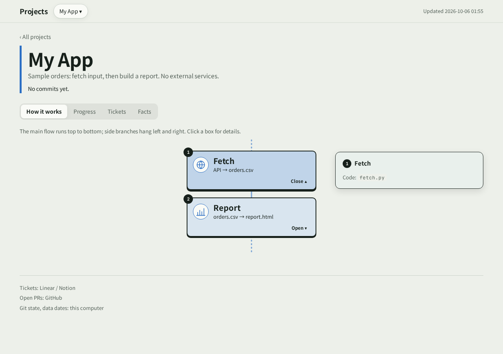

# project-inventory 說明書

## 這是什麼

一個給 Claude Code 用的 skill（技能包）。
它會幫你盤點所有專案，做成一頁網頁。


[手機截圖](skills/project-inventory/reference/demo-mobile.png)。這是 `check_page.py` 用 Chromium
在 1280、390 px 實際拍攝的範例頁面，沒有真實專案資料，也不是外部 API 執行結果。

### 不接服務也能試跑

在 repo checkout 裡執行，使用尚未存在的 demo 目錄：

```sh
mkdir -p .tmp
export TMPDIR="$PWD/.tmp"
python3 skills/project-inventory/reference/demo.py .tmp/demo
python3 skills/project-inventory/scripts/collect.py .tmp/demo
python3 skills/project-inventory/scripts/build.py .tmp/demo
python3 skills/project-inventory/scripts/check_page.py .tmp/demo --shots .tmp/demo-shots
```

打開 `.tmp/demo/out/index.html`。工具從 `example-inventory.json` 產生設定，把外部來源
換成本機範例 CSV；若 home 已有 inventory，會拒絕覆寫。
collect／build 只需 Python、git；瀏覽器檢查另需下方列出的 Playwright／Chromium。

每個專案會看到：

- **運作流程**：專案分成哪幾步。Claude 讀你的程式碼畫草稿，你確認過才算數。
- **待辦**：從 Linear 或 Notion 抓。分成做完、等你確認、還沒做、取消。
- **基本資料**，分兩張表：
  - 本機：程式資料夾（在哪條分支、有沒有改到一半的檔）、資料檔、筆記。
  - 雲端：git 遠端網址、還沒推上去的提交、等你合併的 PR（修改）、Linear 專案、Notion 頁面。
- **Obsidian 筆記**：還沒勾掉的待辦（`- [ ]`）。
- **資料新不新鮮**：直接讀資料裡的日期，不看檔案修改時間。修改時間在複製或重建後會不準。
- **每週進度**：從第一筆紀錄到現在，一週一段白話說明；點開看那週每一筆改動、做完的待辦、新開的 PR。先列 4 週，按「再看更早」往回看。
- **趨勢**：每週改動次數，以及近 90 天待辦數量的變化（只用已知日期倒推；未知期間與不完整的日期涵蓋會標示）。

首頁有一張清單，列出所有專案裡「等你處理的事」。

## 安裝

在 Claude Code 裡打：

```
/plugin marketplace add YuHsunWang/project-inventory
/plugin install project-inventory@project-inventory
```

安裝後重開 Claude Code session（或重載 plugins），執行
`/project-inventory:project-inventory`。plugin 名稱由
`.claude-plugin/plugin.json` 決定；`/project-inventory` 是獨立 skill 的指令。
參考 [Claude Code plugin 載入規則](https://code.claude.com/docs/en/plugins)。

### 用其他 AI 工具（Codex、Hermes…）

不用另外做 MCP server。在這個 repo 的 checkout 裡執行：

```sh
# 乾淨 home／首次安裝：只 clone 一次，再進入 checkout。
git clone https://github.com/YuHsunWang/project-inventory
cd project-inventory
# Codex：即使 ~/.codex 已存在但沒有 skills 也適用。
mkdir -p ~/.codex/skills/project-inventory
cp -R skills/project-inventory/. ~/.codex/skills/project-inventory/
test -f ~/.codex/skills/project-inventory/SKILL.md && echo "Codex skill files OK"
# Hermes：即使 ~/.hermes 已存在但沒有 skills 也適用。
mkdir -p ~/.hermes/skills/project-inventory
cp -R skills/project-inventory/. ~/.hermes/skills/project-inventory/
test -f ~/.hermes/skills/project-inventory/SKILL.md && echo "Hermes skill files OK"
```

**已有安裝：** 進入既有的 repo checkout，執行對應的 `mkdir`、`cp`、`test`。
其他 skill 仍放在各自的資料夾。
**重裝：** 更新 checkout 後重跑相同三行；更新原資料夾，不會多包一層
`project-inventory`。重開工具 session 才能重新發現 skill。

| 宿主 | 驗證範圍／版本 |
|---|---|
| Claude Code plugin | 預期相容；沒有驗證過的宿主版本。待人工重載／重開 session，執行 `/project-inventory:project-inventory` 驗收載入。 |
| Codex 獨立 skill | 已測乾淨 home、既有安裝與重裝的檔案結構；沒有驗證過的宿主版本。新 session 的實際載入待人工驗收。 |
| Hermes 獨立 skill | 同樣測過檔案安裝；預期相容，沒有驗證過的宿主版本。新 session 的實際載入待人工驗收。 |

其他能跑指令的 AI 工具：叫它讀 `skills/project-inventory/SKILL.md`。
`/schedule` 是 Claude Code 的宿主功能。Linear、Notion 要接工具自己的連接器
（Linear 也可以用 `LINEAR_API_KEY`）。

## 怎麼用

跟 Claude 說「幫我盤點專案」，plugin 安裝後打 `/project-inventory:project-inventory`（獨立 skill 用 `/project-inventory`）。

### 第一次：設定（大約 10–20 分鐘）

Claude 會一題一題問你：

1. **要放哪些專案？** 它會先列出它看得到的：Linear 專案、GitHub repo、本機資料夾。你只要挑。
2. **每個專案連到哪？** Linear、Notion、GitHub、本機資料夾、Obsidian 資料夾都可以，有幾個接幾個。
3. **要盯哪些資料？** Claude 會找可能的資料檔給你看。你決定要追蹤哪幾個，還有幾天沒更新算過期。
4. **流程圖對不對？** Claude 讀完程式碼會畫草稿，每個方塊配一個圖示。哪裡不對直接說，它會改。
   它也會問你：方塊點開要放什麼？可以放截圖、公式、或「進去什麼、出來什麼」的示意。截圖要你給檔案。

設定會存在 `~/.project-inventory/inventory.json`。

### 之後：每次叫它就重新盤點

它會重新抓一次所有資料，再把網頁重做一遍。

它也會替「還沒有說明的週」寫一段白話說明。平常只有這週要寫。
第一次要把以前每一週都補完，所以第一次比較久。
說明存在 `~/.project-inventory/summaries.json`。過完的週不會再改。

做完會先告訴你三件事：

- 有沒有東西沒抓到
- 有什麼事在等你
- 哪些資料過期了

## 網頁放哪裡（你選）

| 選項 | 誰看得到 | 要準備什麼 |
|---|---|---|
| 本機檔案（預設） | 只有你這台電腦 | 什麼都不用。打開 `~/.project-inventory/out/index.html` |
| 供手動匯入 claude.ai Artifact 的 HTML | 依宿主；發布、分享與存取權限未驗證 | 相容宿主與人工匯入驗收 |
| Vercel | 限 Vercel 授權使用者；實際範圍依團隊／專案、授權、分享與 bypass 設定 | 裝 Vercel CLI，跑 `vercel login` |
| GitHub Pages | **所有人都看得到** | 一個 GitHub repo |

`build.py` 另產出 `out/artifact.html`：包含樣式、腳本與頁面內容的 HTML fragment，
移除了文件外框與 meta tags，可交給相容宿主手動匯入。
repo 沒有 Artifact 發布 API、宿主能力偵測或 artifact identity 保存；同一路徑不保證同 URL。
端到端匯入／發布驗收仍**待完成**。宣稱支援前，須記錄宿主與版本，測試建立／更新 identity、
固定 URL、外部字型／MathJax 腳本、CSP 處理與分享權限。目前不保證私人或固定網址。

### GitHub Pages 方案與內容預覽

| repo／方案 | 標準 Pages 路徑 |
|---|---|
| GitHub Free、公開 repo | 支援；repo 與網站都公開。 |
| GitHub Free、私人 repo | 不支援。保留本機檔案或換宿主；不能自動把 repo 改成公開。 |
| GitHub Pro／Team、私人 repo | 支援；repo 保持私人，但標準網站公開。 |

參考 [GitHub 官方方案限制](https://docs.github.com/en/pages/getting-started-with-github-pages/what-is-github-pages)。
Enterprise 的存取受限 Pages 是另外的選項，此流程尚未驗證。
發布前先開本機頁面，檢查內嵌資料與圖片：專案名稱、待辦、分支、檔案路徑、截圖都可能公開。
若只想公開最少欄位，另建 inventory home，只保留同意公開的專案名稱、簡介與流程文字；
`sources` 與 `data` 留空，省略 `notes`、node 的 `paths` 與 `media`。
對這個 home 重新 collect、build、預覽；目前沒有自動遮蔽開關。
建立 repo 或 push 前，先確認帳號方案、repo 可見性與確切公開內容。

**Vercel**：第一次放上去之前，會先把網頁鎖起來。放完會用「沒登入的人」身分再檢查一次。如果發現沒鎖好，會直接報錯。

## 要先裝什麼

| 想要的功能 | 要裝什麼 |
|---|---|
| 基本功能 | Python 3.9 以上、git |
| Linear 待辦 | 在 Claude 裡接上 Linear；或設好 `LINEAR_API_KEY`（比較快，不用 Claude 也能抓） |
| Notion 待辦 | 在 Claude 裡接上 Notion |
| GitHub PR | `gh` 指令（要登入），或在 Claude 裡接上 GitHub |
| 讀 parquet / duckdb 資料 | `pip install duckdb` |
| 自動檢查網頁有沒有跑版（可不裝） | `pip install playwright`，再跑 `python3 -m playwright install chromium` |

沒接上的服務不會讓整個盤點失敗。網頁上會寫「這項沒抓到」。

## 常見問題

**Q：可以每天自動跑嗎？**
可以，用 Claude Code 的 `/schedule`。
只用排程（cron）跑腳本也行。有設 `LINEAR_API_KEY` 的話 Linear 也會更新；Notion 要靠 Claude 抓，所以不會更新，網頁會標出來。

三個要注意的地方：

- 用 `collect.py HOME --refresh --script-only` 讓收集與 build 綁定同一次執行。exit 0 成功、1 部分失敗但仍建頁、2 致命失敗，保留舊頁並標出失敗；先修復再重跑，exit 2 後不要發布。
- cron 幾乎沒有環境設定。要自己給 `PATH`（找得到 git、gh）和 `LINEAR_API_KEY`。
- 範例寫在 README 的「Scripts」那段。

**Q：不靠 Claude，要怎麼開始？**
先 clone 這個 repo。腳本在 `skills/project-inventory/scripts/`。
把 `skills/project-inventory/reference/example-inventory.json` 複製成 `~/.project-inventory/inventory.json`，再照你的專案改。

**Q：Vercel 說 project 已經存在，不肯部署？**
這是保護。名字打錯時，才不會蓋掉你別的網站。
如果那個 project 真的就是要放這一頁，加上 `--reuse` 跑一次就好。

**Q：趨勢圖是空的？**
待辦的圖要有接 Linear 或 Notion；改動的圖要有本機 git 資料夾。兩個都是第一次盤點就畫得出來。

**Q：Vercel 一直顯示 `Not authorized`，或卡在 `Building…`？**
通常是 git 記的作者 email 不在你的 Vercel 帳號裡。
去 Vercel 帳號設定加上那個 email，就好了。

**Q：資料過期的判斷不對？**
打開 `inventory.json`，改那份資料的 `column`（日期欄位）或 `max_age_days`（幾天算過期）。

**Q：每週說明寫錯了？**
打開 `~/.project-inventory/summaries.json`，直接改那一週的 `text`。
只用 cron 跑腳本時不會寫新說明，網頁會顯示「這週還沒寫說明」，下次叫 Claude 盤點就會補上。

**Q：流程圖想改？**
跟 Claude 說要改哪裡就好。
你也可以自己改 `inventory.json` 裡的 `nodes`。格式寫在 `skills/project-inventory/reference/schema.md`。

## 檔案在哪

```
~/.project-inventory/
  inventory.json         設定：專案、來源、要盯的資料、流程圖
  gathered/<日期>.json   Claude 從 Linear / Notion 抓回來的待辦
  facts/<日期>.json      每次盤點的結果
  summaries.json         每週的白話說明
  out/index.html         網頁
```

## 架構與支援範圍

`inventory.json` 加上本次 MCP／API 讀取 → `collect.py` → 驗證過的 snapshot 與
`refresh.json` → `build.py` → HTML → 選用瀏覽器檢查／經同意的發布。
每週說明由 AI 工具撰寫，Python 不會自行產生；來源失敗會保留在頁面上。

| 路徑 | 目前支援範圍 |
|---|---|
| 本機 git、CSV／JSON／JSONL／SQLite、筆記 | Python 收集與回歸測試，不必接服務。 |
| Parquet／DuckDB | 選用 DuckDB 套件；有真實來源回歸驗證。 |
| GitHub／Linear | `gh`／API key 或本次 MCP 讀取；須能登入來源服務。 |
| Notion | 連接器流程有離線 mock 測試；真實 workspace 驗收待完成。 |
| 宿主 skill 載入／Artifact 發布 | 宿主與版本的人工驗收待完成。 |
| 頁面排版 | Headless Chromium 檢查桌機／手機；瀏覽器套件可選。 |

開發與回報方式：[CONTRIBUTING.md](CONTRIBUTING.md)。
本分支修正紀錄：[CHANGELOG.md](CHANGELOG.md)。
完整檢查：`python3 tests/release_gate.py`；GitHub CI 會在 push／PR 到 main 時跑同一個指令。
授權：[MIT](LICENSE)。
